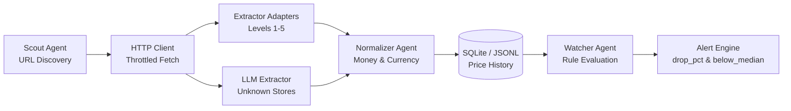

# PriceWatch — E-Commerce Price Intelligence Swarm

[](https://www.python.org/)
[](LICENSE)
[](tests/)

PriceWatch is a swarm of intelligent, specialized agents that track, normalize, evaluate, and alert on product prices across multi-national e-commerce storefronts.

---

## 1. What It Is

PriceWatch monitors e-commerce storefronts by executing a pipeline of specialized agents:



Each stage performs isolated, deterministic responsibilities:
- **Scout**: Discovers product URLs from store indexes while respecting `robots.txt` and robot checks.
- **HTTP Client**: Manages per-host throttling, cookie persistence, browser headers, and `Retry-After` handling.
- **Extractor Adapters**: Extracts raw offer data across 5 levels of storefront friction (JSON-LD, Shopify sales, dynamic class names, challenge pages, and dynamic SPAs).
- **LLM Fallback Extractor**: Handles unknown storefronts via structured LLM prompt extraction.
- **Normalizer**: Converts locale money strings (`720,92 €`, `$1,299.00`, `¥1,500`) into integer minor units (cents) and standard ISO-4217 currencies.
- **Watcher**: Evaluates price historical trends against rule definitions (`drop_pct`, `below_median`).
- **Server**: Exposes a modern, light-theme SaaS analytics dashboard and JSON REST API.

---

## 2. Assignment Implementation Summary

| Stage / Component | Status | Details & Solution |
|---|---|---|
| **Maple & Co Sale Fix** | ✅ Solved | Fixed `.price--sale` vs `.price--compare` selector choice and added European comma decimal format parsing in `normalizer.py`. |
| **Local Store Connection** | ✅ Solved | Wrapped connection errors cleanly to provide actionable setup guidance without raw stack traces. |
| **Issue 1 (Price Drop)** | ✅ Solved | Corrected percentage calculation to `(prev - cur) / prev * 100`. Resolved false alerts. |
| **Issue 2 (Below Median)** | ✅ Solved | Implemented `below_median` rule using `daily_close` aggregation, $\ge 3$ observation requirement, currency checks, and priority over `drop_pct`. |
| **Levels 1–5 Extraction** | ✅ Solved | Handled Corner (JSON-LD), Maple (Shopify/EUR), Zon (Dynamic class regex), Shield (Challenge/Cookies/GBP), Flux (Client SPA script state/JSON API). |
| **Stage 3 LLM Fallback** | ✅ Solved | Implemented provider-independent extraction prompt, clean HTML stripping, strict JSON schema validation, and fault-tolerant evaluation harness. |
| **LLM Providers** | ✅ Solved | Maintained mandatory `--provider anthropic` (`ANTHROPIC_API_KEY`) and `openai` (`OPENAI_API_KEY`) paths. Added `groq` (`GROQ_API_KEY`) and `gemini` (`GEMINI_API_KEY`) for local development. |
| **UI/UX Dashboard** | ✅ Solved | Transformed `pricewatch serve` into a white/light theme SaaS analytics dashboard. |
| **Docker Integration** | ✅ Solved | Built working `Dockerfile` and `docker-compose.yml` for orchestrating stores and backend. |

---

## 3. System Architecture & Component Responsibilities

### Data Flow Pipeline
1. `pricewatch scan` triggers `orchestrator.scan()`.
2. `scout.discover()` fetches the store index and extracts product URLs.
3. `Client.get()` fetches each product page with throttling and cookie retention.
4. `extractor.extract()` selects the appropriate store adapter (`corner`, `maple`, `zon`, `shield`, `flux`). If `--llm` is set, `llm_extractor.extract_with_llm()` is invoked.
5. `normalizer.parse_money()` converts money strings to minor units (`price_cents`).
6. `storage.History` writes observations to SQLite or JSONL.
7. `watcher.evaluate()` runs alert rules against historical observations.

---

## 4. Local Setup & Execution (Windows PowerShell Verified)

### Prerequisites
- Python 3.10+
- Docker Desktop (Optional, for containerized execution)

### 1. Clone & Environment Setup
```powershell
# Clone the repository
git clone <repository_url>
cd pricewatch-starter

# Create & activate Python virtual environment
python -m venv .venv
.\.venv\Scripts\activate

# Install project with development & LLM optional dependencies
pip install -e ".[dev,llm]"
```

### 2. Start Fake Store Server
```powershell
# Run the fake store server locally via Docker on port 4000
docker run --rm -p 4000:4000 -e STORE_SEED=public ghcr.io/i95dev/pricewatch-stores:latest
```

### 3. Run Scanning & Alerts
```powershell
# Scan Corner Store
pricewatch scan --stores-url http://localhost:4000 --store corner --out obs_corner.jsonl

# Scan Maple & Co
pricewatch scan --stores-url http://localhost:4000 --store maple --out obs_maple.jsonl

# Evaluate Alert Rules against History
pricewatch watch --history fixtures/history.jsonl --new fixtures/new.jsonl --rules alerts.yaml
```

### 4. Run HTTP Dashboard Server
```powershell
pricewatch serve --port 8000
# Open http://localhost:8000 in your web browser
```

---

## 5. LLM Provider Setup & Evaluation (Stage 3)

### Installation
```powershell
pip install -e ".[llm]"
```

### Provider Configuration
The autograder evaluates the submission using its own **Anthropic API key** with:
```powershell
$env:ANTHROPIC_API_KEY="your_anthropic_key"
pricewatch extract --url http://localhost:4000/stores/corner/p/1 --llm --provider anthropic
```

For local development, you can use **Groq**, **Gemini**, **OpenAI**, or **Anthropic**:
```powershell
# Development with Groq
$env:GROQ_API_KEY="your_groq_key"
pricewatch eval --snapshots eval/snapshots --labels eval/labels.json --provider groq --out eval/out

# Development with Gemini
$env:GEMINI_API_KEY="your_gemini_key"
pricewatch eval --snapshots eval/snapshots --labels eval/labels.json --provider gemini --out eval/out
```

### Evaluation Run Output Schema
`pricewatch eval` generates `eval/out/report.json` and `eval/out/label_issues.json`:
```json
{
  "provider": "echo",
  "model": "default",
  "n": 90,
  "overall": {
    "price_exact": 0.83,
    "currency": 0.98,
    "availability": 0.90,
    "pack_size": 0.92
  },
  "per_store": {
    "nordkart": { "n": 45, "price_exact": 0.80, "currency": 1.0, "availability": 0.9, "pack_size": 0.93 },
    "bazaario": { "n": 45, "price_exact": 0.87, "currency": 0.97, "availability": 0.9, "pack_size": 0.90 }
  },
  "errors": { "timeout": 0, "malformed_output": 0, "provider_error": 0 },
  "cost": { "input_tokens": 13599, "output_tokens": 4500, "usd_estimate": 0.0047 },
  "latency_ms": { "p50": 4.5, "p95": 7.0 },
  "baseline": { "price_exact": 0.0 }
}
```

---

## 6. Automated Testing

Run the complete automated test suite using `pytest`:
```powershell
pytest
```
Test suite contains **32 automated unit and integration tests** validating:
- `test_normalizer.py`: US, European, zero-decimal JPY, and currency detection formatting.
- `test_extractor_maple.py`: Maple sale price vs compare-at price extraction.
- `test_extractor_stores.py`: Dynamic class parsing for Zon, challenge handling for Shield, and SPA script state for Flux.
- `test_watcher.py`: `drop_pct` formula, `below_median` rule, 3-observation minimum threshold, currency checks, and rule priority.
- `test_eval_and_providers.py`: Provider loading, Anthropic/OpenAI/Groq/Gemini interfaces, and evaluation harness fault tolerance.
- `test_server.py`: FastAPI health and dashboard HTML rendering.

---

## 7. Docker Orchestration

Build and run both the fake store server and PriceWatch backend via Docker Compose:
```powershell
docker compose build
docker compose up
```
Services started:
- `pricewatch-stores`: Listening on `http://localhost:4000`
- `pricewatch-app`: Dashboard & API listening on `http://localhost:8000`

---

## 8. Production Deployment Guide

To deploy PriceWatch into a production environment (e.g. AWS ECS, Render, Railway, or Fly.io):

1. **Infrastructure Requirements**:
   - Docker container runtime (1 vCPU, 1 GB RAM minimum).
   - Managed PostgreSQL or persistent SQLite storage volume for `pricewatch.db`.
2. **Environment Variables**:
   - `ANTHROPIC_API_KEY` / `OPENAI_API_KEY` / `GROQ_API_KEY` / `GEMINI_API_KEY`
   - `PRICEWATCH_PROVIDER` (`anthropic` or `openai`)
   - `STORES_URL` (Target storefront base URL)
3. **Health Check & Monitoring**:
   - Configure load balancer health check endpoint to `GET /health` (expects HTTP 200 `{"status": "healthy"}`).
4. **Security Hardening**:
   - Store API keys in secret manager (AWS Secrets Manager or Railway Secrets).
   - Place PriceWatch behind an HTTPS reverse proxy (Cloudflare or Nginx).
   - Restrict outbound HTTP rate limits to respect target storefront `robots.txt` and `Retry-After` headers.

---

## 9. Security & Governance

- **No Committed Secrets**: `.env` is listed in `.gitignore`. Template provided in `.env.example`.
- **SSRF Prevention**: Store URLs loaded strictly from validated configuration files (`stores.yaml`).
- **Politeness & Rate Limits**: Global per-host throttling enforced by `Client` class in `http.py`.

---

## 10. Engineering Documentation

For in-depth architectural rationale, trade-off analysis, and post-mortem notes:
- See [DECISION_LOG.md](DECISION_LOG.md) for autograder frontmatter & decision rationale.
- See [IMPLEMENTATION_NOTES.md](IMPLEMENTATION_NOTES.md) for detailed technical implementation notes.
